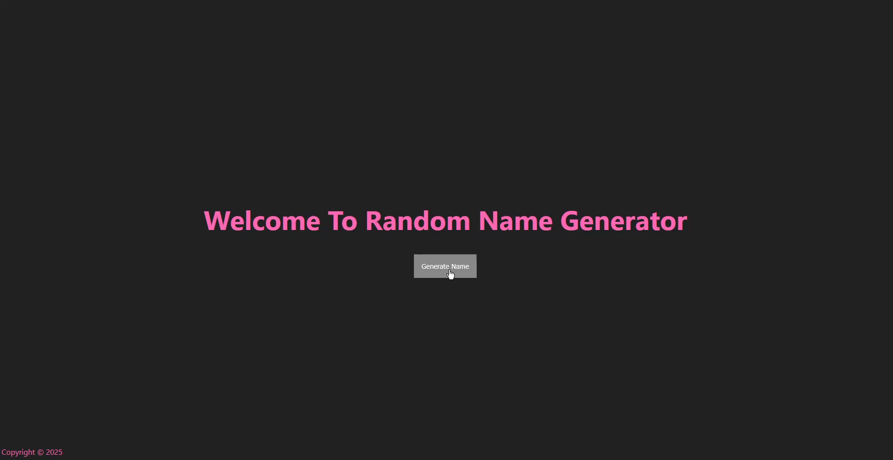

# Band Name Generator

This is a simple web application that generates random band names using adjectives and nouns. The application is built using Express.js and EJS for templating.

## Installation

1. Clone the repository:
   ```sh
   git clone https://github.com/yourusername/band-name-generator.git
   ```
2. Navigate to the project directory:
   ```sh
   cd band-name-generator
   ```
3. Install the dependencies:
   ```sh
   npm install
   ```

## Usage

1. Start the server:
   ```sh
   node index.js
   ```
2. Open your browser and navigate to `http://localhost:3000`.

## Demo



## License

This project is licensed under the MIT License.
